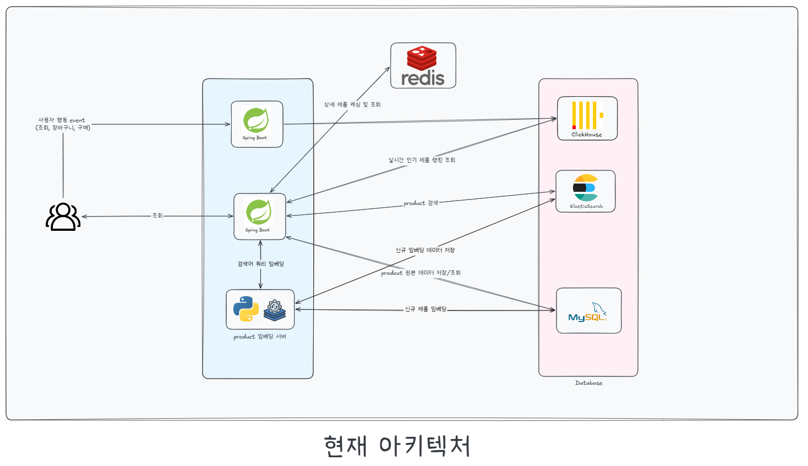

# AWS - Shopping Service
> E-commerce의 대용량/ 대규모 처리, 검색, 캐시, 동시성 문제를 학습하기 위해 진행하였습니다.

데이터 : AWS-Reviews의 데이터 250만개를 사용하였습니다. 

---
## 아키텍처

---
## 문서 정리

### DB 성능 최적화
- [인덱스 생성 및 캐싱을 통해, 상품 상위 N개 조회 성능 개선한 방법](https://app.notion.com/p/DB-N-39cfc6c66701809d8645d926059377d1?source=copy_link)
- [Redis 캐싱을 통한 상품 상세 조회 속도 개선한 방법](https://app.notion.com/p/Cache-DB-3a5fc6c6670180aab9f5e62dfc8b488a?source=copy_link)
- [실시간 인기 랭킹 제품 조회 시, Redis가 아닌 Clickhous를 사용한 이유](https://app.notion.com/p/Raking-Redis-ClickHouse-39cfc6c667018095bed9c308138b3468?source=copy_link)

### 테스트
- [RPS 5000 사용자 행동 이벤트 트래픽 처리하기](https://app.notion.com/p/Ranking-RPS-5000-39cfc6c6670180d3b460f6cf054c2c6a?source=copy_link)

### ETL 파이프라인
- [1000만개 데이터를 자동으로 DB에 업로드시킨 방법](https://app.notion.com/p/Data-1000-ETL-39cfc6c66701803dba09d512a8f86c31?source=copy_link)
