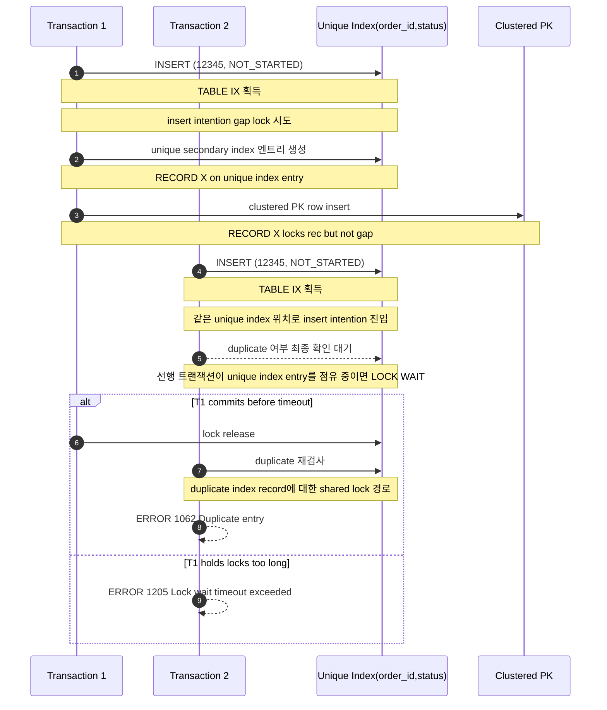
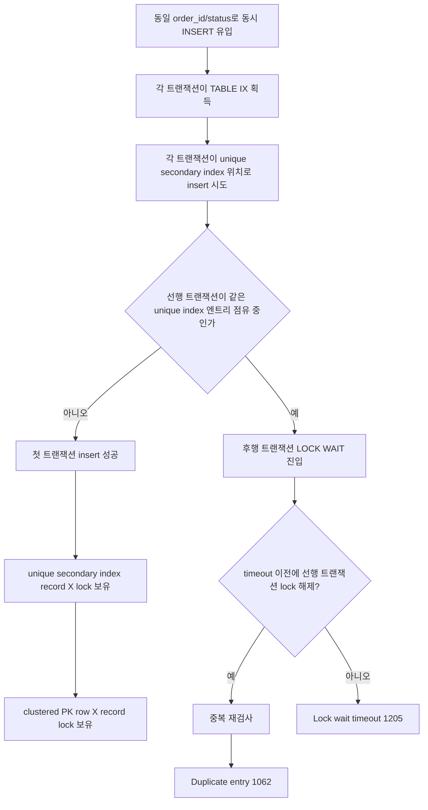

# Payment 중복 생성 락 흐름

## 개요
- 대상 시나리오: 여러 요청이 동시에 같은 `(order_id, status='NOT_STARTED')`로 `payment`를 insert
- 핵심 충돌 지점: `payment(order_id, status)` unique secondary index
- 핵심 포인트: 이 문제는 단순 duplicate key 경쟁이 아니라, duplicate 판정 전에 lock wait가 먼저 걸릴 수 있다는 점이다.

## 락 종류

### 1. `TABLE IX`
- 각 `INSERT` 트랜잭션이 갖는 intention exclusive table lock
- 실제 병목은 아니다.
- 행/인덱스 레벨에 X 계열 락을 잡을 예정임을 테이블 수준에 표시한다.

### 2. `RECORD X locks rec but not gap`
- insert가 실제로 성공해 새 인덱스 레코드를 만든 뒤 가지는 exclusive record lock
- MySQL 문서 기준으로 `INSERT`는 inserted row에 대해 index-record lock을 잡는다.
- next-key lock이 아니라 record lock이다.

### 3. `RECORD X locks gap before rec insert intention waiting`
- insert intention gap lock
- insert 직전에 잡는 gap lock의 한 종류다.
- 서로 다른 위치에 insert하는 세션끼리는 동시에 갈 수 있지만,
  지금처럼 같은 unique key 위치를 노리면 충돌 지점에서 대기할 수 있다.

### 4. duplicate index record에 대한 shared lock 요청
- MySQL 문서에는 duplicate-key error가 발생할 때 duplicate index record에 shared lock이 설정된다고 설명한다.
- 이 케이스에서는 뒤 세션이 먼저 점유된 unique index 엔트리를 기준으로 중복 여부를 최종 확인해야 하므로,
  그 확인 과정도 선행 트랜잭션의 lock release 시점에 영향을 받는다.

## 전체 흐름

## 대기열 기준 흐름

## k6 시나리오에 대입한 해석
- [k6/payment-create-duplicate-guard.js](/mnt/c/Users/정석찬/Desktop/project/aws-shop/k6/payment-create-duplicate-guard.js)는 같은 `orderId`를 50 VU가 동시에 보낸다.
- [PaymentService.createPayment()](/mnt/c/Users/정석찬/Desktop/project/aws-shop/src/main/java/jeong/awsshop/payment/application/PaymentService.java:44)는 사전 선점 없이 바로 insert 경쟁으로 들어간다.
- 따라서 첫 요청 하나는 unique index entry를 만들고,
  나머지는 같은 unique key 위치에서 lock queue로 밀린다.
- 이 큐에서 빨리 깨어난 요청은 duplicate로 끝나고,
  오래 묶인 요청은 lock wait timeout으로 끝난다.

## 왜 랜덤처럼 보이는가
- 각 요청은 DB insert 전에 주문 조회를 먼저 한다.
- 즉 50개 요청의 DB 진입 시점이 완전히 동일하지 않다.
- 누가 먼저 unique index entry를 선점하는지,
  그 시점에 몇 개 트랜잭션이 이미 queue에 들어와 있는지,
  선행 트랜잭션이 언제 커밋되는지가 매번 달라진다.
- 그래서 같은 부하 스크립트여도 어떤 실행에서는 초반부터 timeout이 나오고,
  어떤 실행에서는 한참 뒤에 timeout이 나온다.

## 이 문서에서 말하는 락의 범위
- `TABLE IX`는 보조적이다.
- 실제 병목은 `payment(order_id, status)` unique secondary index 주변의
  `insert intention gap lock`, `record X lock`, 그리고 duplicate 확인을 위한 인덱스 레코드 락 대기다.
- 즉 이 문제는 "payment 행 전체 테이블 락" 문제가 아니라 "같은 unique index 엔트리 위치 경쟁" 문제다.

## 참고 자료
- MySQL 5.7 Reference Manual, "Locks Set by Different SQL Statements in InnoDB":
  https://dev.mysql.com/doc/refman/5.7/en/innodb-locks-set.html
- MySQL 8.4 Reference Manual, "InnoDB Locking":
  https://dev.mysql.com/doc/refman/8.4/en/innodb-locking.html
- MySQL 8.0 Reference Manual, "InnoDB Lock and Lock-Wait Information":
  https://dev.mysql.com/doc/refman/8.0/en/innodb-information-schema-understanding-innodb-locking.html
